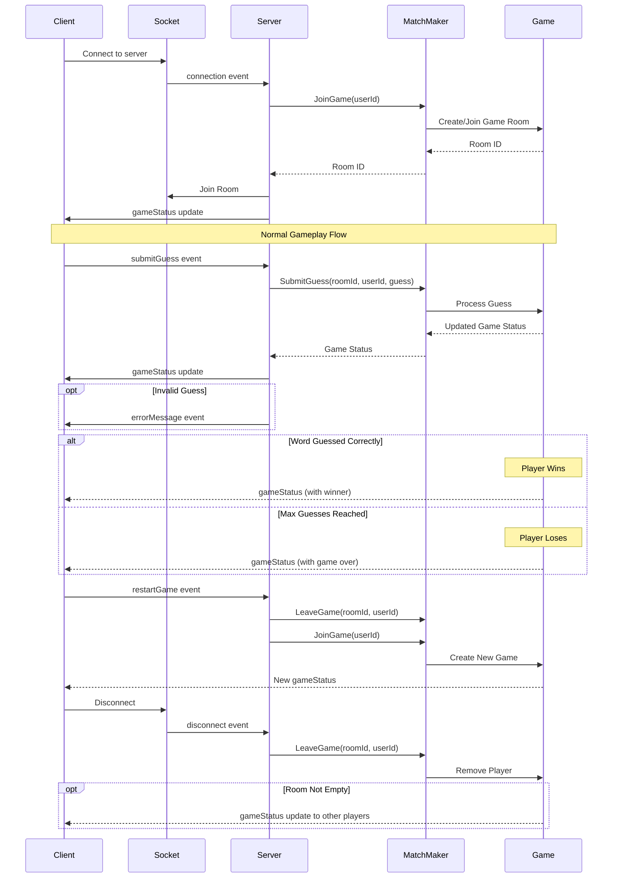

# Client-Server Communication Flow

## Flow Diagram

## Key Interactions

1. **Initial Connection**

   - Client connects via Socket.io
   - Server assigns player to a game room
   - Initial game state sent to client

2. **Gameplay**

   - Client submits guesses via socket events
   - Server validates and processes guesses
   - All players in room receive game state updates
   - Error messages sent for invalid guesses

3. **Game End Conditions**

   - Player wins by guessing word correctly
   - Player loses after reaching max guesses
   - Game status updated for all players

4. **Game Restart**

   - Player requests game restart
   - Server creates or assigns new game room
   - Fresh game state sent to players

5. **Disconnection**
   - Player disconnection handled gracefully
   - Room cleanup if empty
   - State updates to remaining players

## Event Types

### Client to Server

- `submitGuess` - Send a word guess
- `restartGame` - Request new game
- `disconnect` - Client disconnection

### Server to Client

- `gameStatus` - Game state updates
- `errorMessage` - Validation errors
- `connect`/`disconnect` - Connection status

## State Management

The game state is managed by three main classes:

- `WordleMatchMakingController` - Manages rooms and player assignment
- `WordleGame` - Handles core game logic and state
- Client React state - Manages UI and local game state
